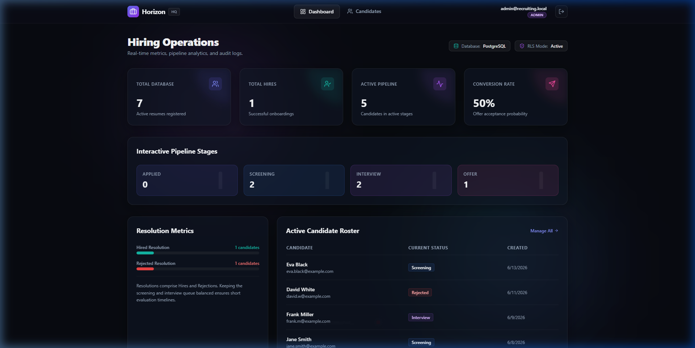
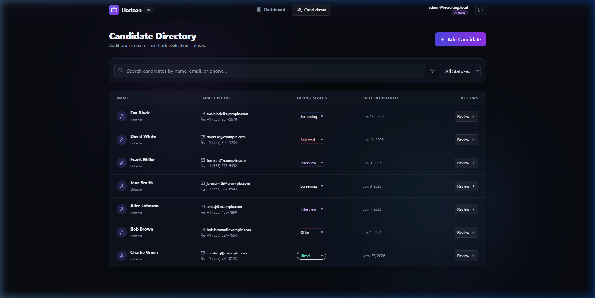
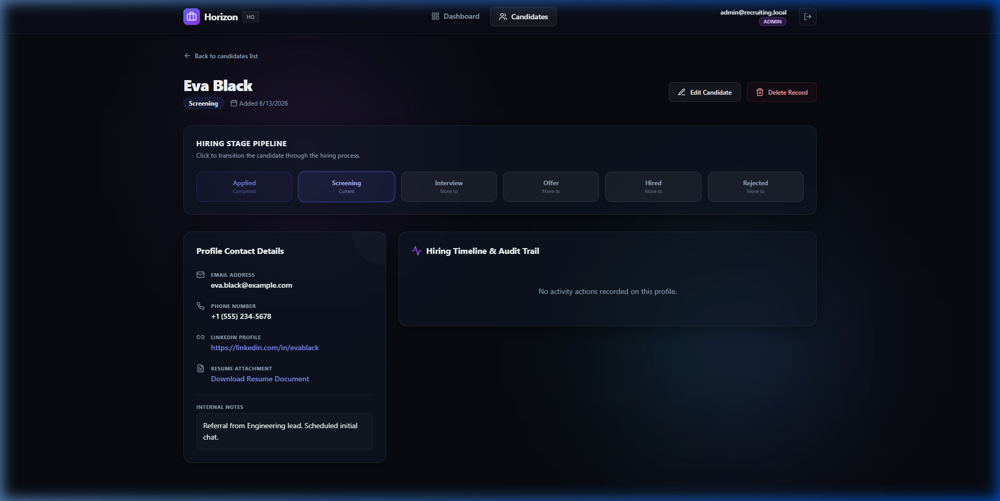
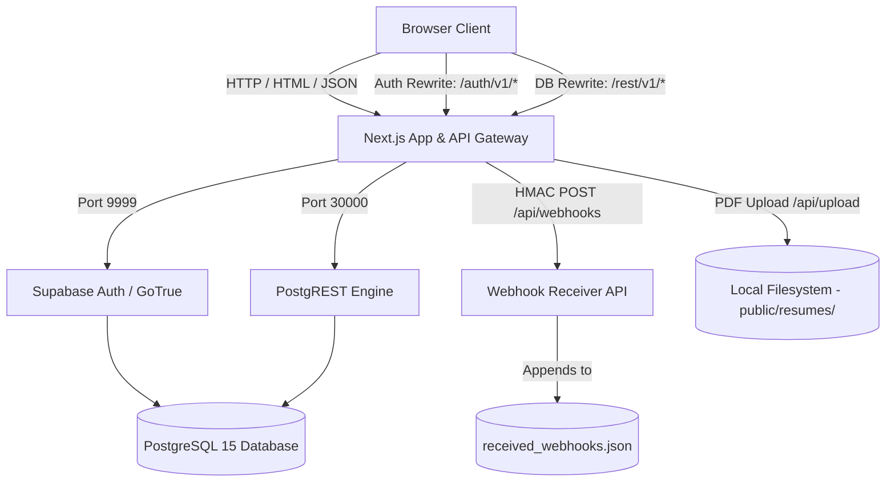
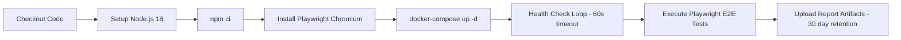

# Horizon: Candidate Pipeline & Recruiting Activity Tracker

[](https://nextjs.org/)
[](https://playwright.dev/)
[](https://supabase.com/)
[](https://tailwindcss.com/)
[](https://www.postgresql.org/)
[](https://docs.docker.com/compose/)
[](https://github.com/features/actions)
[](https://opensource.org/licenses/MIT)

**Horizon** is a production-grade candidate pipeline tracking and hiring management platform. Built as a comprehensive QA engineering portfolio project, it features a full-stack application with robust end-to-end testing (39 tests across 8 spec files), role-based access controls (RBAC), immutable audit trails, HMAC-signed webhooks, resume file uploads, and a complete CI/CD pipeline — all containerized with Docker Compose.

---

## 📸 Screenshots

| Dashboard Analytics | Candidate Directory | Candidate Detail & Pipeline |
| :---: | :---: | :---: |
|  |  |  |

---

## 🚀 Key Features

### Application & UI
*   **Interactive Hiring Pipeline Stepper**: Visual stage transition buttons on the candidate detail page (`Applied` ➔ `Screening` ➔ `Interview` ➔ `Offer` ➔ `Hired` / `Rejected`) with real-time status updates and loading indicators.
*   **Inline Status Dropdown**: Quick-change status selectors directly in the candidate list table for Admin/Recruiter roles, with disabled states for Viewers.
*   **Dashboard Analytics**: Real-time metrics including Total Candidates, Total Hires, Active Pipeline count, and Offer-to-Hire Conversion Rate, with interactive pipeline stage cards featuring mini bar chart visualizations.
*   **Resolution Metrics Panel**: Progress bars showing Hired vs Rejected resolution ratios against total candidates.
*   **Candidate Directory Table**: Sortable candidate list with avatar indicators, email/phone display, LinkedIn profile links, date formatting, and role-aware inline status editing.
*   **Candidate Detail View**: Full profile page with contact details (email, phone, LinkedIn, resume download), internal notes, and a complete hiring timeline/audit trail with visual timeline dots.
*   **Slide-out Add Candidate Drawer**: Modal form for creating new candidates with fields for name, email, phone, LinkedIn URL, resume PDF upload, initial pipeline status, and internal notes.
*   **Public Candidate Application Portal**: Unauthenticated `/apply` page where candidates can self-submit their application (name, email, phone, LinkedIn, resume PDF upload, cover letter) without needing a login.
*   **Debounced Live Search**: 300ms debounced search filtering candidates by name, email, or phone across the candidate directory.
*   **Pipeline Status Filter**: Dropdown filter to view candidates by specific hiring stages (`Applied`, `Screening`, `Interview`, `Offer`, `Hired`, `Rejected`).
*   **Empty State Handling**: User-friendly messaging when no candidates match search/filter queries.
*   **Quick Login Demo Buttons**: One-click demo login buttons for Admin, Recruiter, and Viewer roles on the login page for rapid testing.
*   **Database Reset Button**: Dev-only "Reset Demo Data" button on the login page that calls the `/api/test/reset` endpoint to re-seed the database.
*   **Custom Delete Confirmation Modal**: Glassmorphism-styled confirmation dialog for Admin candidate deletion (replaces native `confirm()` dialogs).

### Design System
*   **Dark Mode Glassmorphism UI**: Custom design system built with Tailwind CSS featuring backdrop blur effects, translucent glass cards, gradient borders, and ambient glow backgrounds.
*   **Custom CSS Utilities**: Reusable `.glass-card`, `.glass-input`, and `.glass-sidebar` component classes with consistent `rgba` backgrounds, blur filters, and border treatments.
*   **Ambient Background Glows**: Three positioned radial blur elements (purple, indigo, teal) creating depth and atmosphere.
*   **Custom Color Palette**: Extended Tailwind theme with semantic tokens (`background`, `cardBackground`, `borderLight`, `accentPurple`, `accentIndigo`, `accentPink`, `accentTeal`, `textMuted`, `textLight`).
*   **Status Badge System**: Color-coded status badges with consistent `bg/text/border` styling per pipeline stage across all views.
*   **Role Badge System**: Color-coded user role indicators (purple for Admin, indigo for Recruiter, teal for Viewer) in the navigation bar.
*   **Custom Scrollbar**: Styled WebKit scrollbar with translucent thumb and track.
*   **Lucide React Icons**: Consistent iconography throughout the application using the Lucide icon library.

### Security & Authentication
*   **Role-Based Access Control (RBAC)**: Three-tier permission system:
    * **Admin**: Full CRUD permissions — can create, read, update, and delete candidates.
    * **Recruiter**: Partial CRUD — can create, read, and update candidates, but cannot delete.
    * **Viewer**: Read-only — can search, filter, and review details, but cannot modify any data.
*   **Supabase GoTrue Authentication**: Email/password authentication via GoTrue with JWT session tokens stored in cookies (`sb-access-token`).
*   **Next.js Edge Middleware**: Route protection middleware that redirects unauthenticated users to the login page and authenticated users away from the login page to the dashboard. Exempts public routes (`/apply`, `/api/*`, `/auth/*`, `/rest/*`).
*   **PostgreSQL Row-Level Security (RLS)**: 8 RLS policies enforcing data access at the database level across `profiles`, `candidates`, `audit_logs`, and `audit_webhooks` tables.
*   **Server-Side RBAC Enforcement**: API routes validate user roles server-side before allowing mutations (POST/PUT/DELETE), returning `401 Unauthorized` or `403 Forbidden` as appropriate.
*   **Secure Session Cleanup**: Login page proactively clears stale cookies, `localStorage` tokens, and calls `supabase.auth.signOut()` on mount to ensure clean session state.
*   **Server-Side Logout Endpoint**: Dedicated `/api/auth/logout` POST route that expires the `sb-access-token` cookie with `httpOnly` and `sameSite` flags.
*   **Production Environment Guard**: The `/api/test/reset` endpoint is blocked in production (`NODE_ENV === 'production'` returns `403`).

### API Layer
*   **RESTful API Routes** (Next.js Route Handlers):
    * `GET /api/candidates` — List, search (by name/email/phone via `ilike`), and filter candidates (by status).
    * `POST /api/candidates` — Create a new candidate (Admin/Recruiter only) with server-side validation and audit log creation.
    * `GET /api/candidates/[id]` — Retrieve a single candidate with associated audit logs and webhook history.
    * `PUT /api/candidates/[id]` — Update a candidate with automatic field-level diff detection, audit logging, and conditional webhook dispatch.
    * `DELETE /api/candidates/[id]` — Delete a candidate (Admin only) with cascade cleanup of audit logs.
    * `POST /api/apply` — Public (unauthenticated) candidate self-application endpoint with validation and audit logging.
    * `POST /api/upload` — Resume PDF file upload endpoint with MIME type validation, UUID-based unique naming, and local filesystem storage in `public/resumes/`.
    * `GET /api/webhooks` — Retrieve all received webhook payloads (for QA verification).
    * `POST /api/webhooks` — Webhook receiver with HMAC-SHA256 signature verification and JSON file logging.
    * `DELETE /api/webhooks` — Clear all received webhooks (test state reset helper).
    * `POST /api/auth/logout` — Server-side session cookie expiration.
    * `POST /api/test/reset` — Database reset via the `reset_test_database()` stored procedure (dev/test only).
*   **Input Validation**: Server-side validation for required fields (name, email format) and enum constraints (pipeline status values) returning structured `400` errors.
*   **Origin Unification Proxy**: Next.js `rewrites` in `next.config.js` route client `/auth/v1/*` requests to the GoTrue container and `/rest/v1/*` requests to the PostgREST container, keeping the browser CORS-free on a single origin.

### Data & Audit System
*   **Immutable Activity Audit Trail**: Every candidate creation (`CREATE`) and update (`UPDATE`) action writes to the `audit_logs` table with actor ID, actor role, action type, and a JSONB `changed_fields` diff showing `{ field: { from: "old", to: "new" } }` for each modified field.
*   **Visual Hiring Timeline**: The candidate detail page renders audit logs as a vertical timeline with dot markers, role badges, timestamps, and human-readable change descriptions.
*   **HMAC-Signed Interview Webhooks**: When a candidate's status transitions to `Interview`, the server automatically dispatches a webhook POST to the configured receiver URL, signed with an HMAC-SHA256 signature in the `X-Recruiting-Signature` header. The receiver verifies the signature before accepting the payload.
*   **Webhook Audit Table**: All webhook dispatches are logged in the `audit_webhooks` table with the full payload, target URL, response status, response body, success flag, and retry count.
*   **Resume PDF Upload**: File upload API that validates PDF MIME type, generates UUID-prefixed filenames, stores files locally in `public/resumes/`, and returns a URL path for candidate record linking.
*   **Database Reset Procedure**: The `reset_test_database()` PostgreSQL stored procedure fully resets auth users, identities, profiles, candidates, and audit logs back to seed state — with dynamic SQL to handle auth schema availability.

---

## 🏗️ System Architecture

Horizon runs on a unified Docker Compose architecture proxying authentication and database requests to keep the browser environment CORS-free:



*   **Origin Unification Proxy**: The Next.js server acts as an API gateway rewriting client requests. `/auth/v1/*` routes to `gotrue:9999`, and `/rest/v1/*` routes to `postgrest:3000`, securing internal service details from external exposure.
*   **Dual Supabase Clients**: The application uses two Supabase clients — a public `supabase` client (with `persistSession` and `autoRefreshToken`) for browser auth flows, and a privileged `supabaseAdmin` client (with `service_role` key and no session persistence) for server-side database operations. The admin key is guarded against client-side bundle leakage.
*   **Custom Fetch Layer**: A custom `fetch` wrapper strips the `/rest/v1/` prefix when the Next.js server talks directly to PostgREST in Docker, maintaining compatibility with the Supabase JS client's URL construction.

---

## 🗄️ Database Schema

The PostgreSQL schema consists of four tables with RLS enabled on all:

| Table | Purpose | Key Columns |
| :--- | :--- | :--- |
| `profiles` | Maps auth users to RBAC roles | `id` (UUID, PK), `role` (Admin/Recruiter/Viewer) |
| `candidates` | Stores candidate records | `id`, `name`, `email`, `phone`, `linkedin`, `resume_url`, `status`, `notes`, `created_at`, `updated_at` |
| `audit_logs` | Immutable activity trail | `candidate_id` (FK CASCADE), `actor_id`, `actor_role`, `action`, `changed_fields` (JSONB) |
| `audit_webhooks` | Webhook dispatch history | `candidate_id` (FK CASCADE), `event_type`, `payload` (JSONB), `target_url`, `response_status`, `success` |

**Stored Procedures:**
*   `handle_new_user()` — Trigger function that syncs `auth.users` to `public.profiles` on user creation (via `ON CONFLICT DO UPDATE`).
*   `get_my_role()` — Security definer function that extracts the current user's role from `profiles` using the JWT `sub` claim, used in all RLS policies.
*   `reset_test_database()` — Full database reset procedure with dynamic SQL for auth schema operations.

---

## 🔑 Demo Sandbox Access

Horizon is pre-seeded with three access levels and 8 candidate records spanning all 6 pipeline stages:

| User Email | Role | Actions Permitted |
| :--- | :---: | :--- |
| `admin@recruiting.local` | **Admin** | Full CRUD — create, edit, delete candidates, reset sandbox |
| `recruiter@recruiting.local` | **Recruiter** | Partial CRUD — create & edit candidates, cannot delete |
| `viewer@recruiting.local` | **Viewer** | Read-only — search, filter, and review details only |

> **Password for all accounts:** `password123`

### Seeded Candidates

| Name | Status | Notes |
| :--- | :---: | :--- |
| John Doe | Applied | Strong background in React and Node.js |
| Jane Smith | Screening | Passed initial phone screen |
| Alice Johnson | Interview | Technical assessment complete |
| Bob Brown | Offer | Offer package sent ($135k base) |
| Charlie Green | Hired | Offer accepted, start date set |
| David White | Rejected | Failed technical test |
| Eva Black | Screening | Engineering lead referral |
| Frank Miller | Interview | Positive hiring manager feedback |

---

## 🛠️ Local Installation & Development

### Prerequisites

*   **Docker & Docker Compose** installed (for the full containerized stack).
*   **Node.js v18+** installed (for running local tests and development).

### Deployment Steps

1.  Clone the repository and enter the directory:
    ```bash
    git clone https://github.com/allantaveras/horizon-recruiting-platform.git
    cd horizon-recruiting-platform
    ```
2.  Copy the environment file:
    ```bash
    cp .env.example .env
    ```
3.  Deploy the local containerized stack:
    ```bash
    docker-compose up --build
    ```
    This spins up 4 containers:
    * `recruiting-db` — PostgreSQL 15 (port 54322)
    * `recruiting-auth` — Supabase GoTrue v2.143.0 (port 9999)
    * `recruiting-postgrest` — PostgREST v11.1.0 (port 30000)
    * `recruiting-app` — Next.js 14 dev server (port 3000)

4.  Access the platform in your browser: [http://localhost:3000](http://localhost:3000)

### Resetting the Sandbox

The database is initialized automatically with test seeds. Reset the sandbox at any time by:

*   Clicking the **"Reset Demo Data (Dev Only)"** button on the Login page, or
*   Sending a POST request:
    ```bash
    curl -X POST http://localhost:3000/api/test/reset
    ```

### Environment Variables

| Variable | Description |
| :--- | :--- |
| `NEXT_PUBLIC_SUPABASE_URL` | Supabase API base URL (proxied through Next.js) |
| `NEXT_PUBLIC_SUPABASE_ANON_KEY` | Supabase anonymous JWT for client-side auth |
| `SUPABASE_SERVICE_ROLE_KEY` | Supabase service role JWT for server-side admin operations |
| `DATABASE_URL` | PostgreSQL connection string |
| `WEBHOOK_SECRET` | HMAC-SHA256 secret for webhook signature generation/verification |
| `NEXT_PUBLIC_WEBHOOK_RECEIVER_URL` | Target URL for interview webhook dispatch |

---

## 🧪 Testing Suite & QA Verification

The repository includes a comprehensive E2E testing infrastructure with **39 test cases across 8 spec files**, covering UI automation, API validation, RBAC enforcement, and webhook verification.

### Running Tests
```bash
# Install local dependencies & Playwright browsers
npm install
npx playwright install chromium

# Run all tests headlessly (sequential — single worker to prevent DB state collision)
npm run test

# Open Playwright UI mode for interactive inspection
npx playwright test --ui
```

### Playwright Configuration
*   **Sequential execution**: `fullyParallel: false` with `workers: 1` to prevent database state collision between tests.
*   **Trace capture**: `retain-on-failure` for post-mortem debugging.
*   **Screenshots & Video**: Captured only on failure to minimize artifacts.
*   **CI Reporter**: Uses Playwright `blob` reporter in CI, `html` reporter locally.

### Test Coverage Matrix

| Test File | Category | Tests | Coverage |
| :--- | :--- | :---: | :--- |
| `tests/api.spec.ts` | API Protection & Validation | 12 | Auth 401, RBAC 403, input validation 400, HMAC webhook 401, CRUD lifecycle, public apply API |
| `tests/auth.spec.ts` | Role-Based Authentication | 3 | Unauthenticated redirects, Admin login/logout, Viewer read-only access |
| `tests/apply.spec.ts` | Candidate Self-Application | 1 | Full public apply → Admin review → detail verification flow |
| `tests/candidates.spec.ts` | Candidate Management CRUD | 2 | Create/edit/audit trail validation, Admin delete with confirmation modal |
| `tests/dashboard.spec.ts` | Dashboard Analytics | 4 | Pipeline statistics accuracy, recent activity, role-based dashboard views |
| `tests/search-filter.spec.ts` | Search & Filter | 6 | Name/email search, status filter, empty states, filter reset |
| `tests/pipeline.spec.ts` | Pipeline Stage Transitions | 4 | Stepper clicks, rejection flow, Viewer disabled buttons, inline dropdown |
| `tests/validation.spec.ts` | Form Validation | 7 | Apply form, add modal, edit form validation errors, cancel behavior |

### Detailed Test Case IDs

<details>
<summary>Click to expand full test case listing</summary>

#### API Endpoint Protection (`tests/api.spec.ts`)
| ID | Description |
| :--- | :--- |
| TC-AUTH-API-01 | Unauthenticated API queries return `401 Unauthorized` |
| TC-AUTH-API-02 | Recruiter attempting record deletion returns `403 Forbidden` |
| TC-AUTH-API-03 | Viewer attempting record creation returns `403 Forbidden` |
| TC-CAND-API-01 | Missing name or invalid email on candidate creation returns `400` |
| TC-CAND-API-02 | Authenticated user retrieves candidate list successfully |
| TC-CAND-API-03 | Recruiter creates candidate via API successfully |
| TC-CAND-API-04 | Empty name on candidate update returns `400` |
| TC-PIPE-API-01 | Invalid pipeline status enum value returns `400` |
| TC-WEB-API-01 | Webhooks without valid HMAC signature return `401` |
| TC-APPLY-API-01 | Public apply with missing name returns `400` |
| TC-APPLY-API-02 | Public apply with invalid email returns `400` |
| TC-APPLY-API-03 | Valid public application returns `201` |

#### UI Automation (`tests/auth.spec.ts`, `tests/apply.spec.ts`, `tests/candidates.spec.ts`)
| ID | Description |
| :--- | :--- |
| TC-AUTH-01 | Unauthenticated users redirected to login page |
| TC-AUTH-02 | Admin login, navigation verification, and logout |
| TC-AUTH-03 | Viewer read-only access limits verified |
| TC-APPLY-01 | Full candidate self-application → admin review flow |
| TC-CAND-01 | Create, edit, audit trail, and deletion limit validation |
| TC-CAND-02 | Admin deletes candidate with custom confirmation modal |

#### Dashboard, Search, Pipeline, Validation
| ID | Description |
| :--- | :--- |
| TC-DASH-01 | Dashboard displays accurate pipeline statistics for all seeded candidates |
| TC-DASH-02 | Recent candidate activity entries visible |
| TC-DASH-03 | Viewer sees dashboard in read-only context |
| TC-DASH-04 | Recruiter sees dashboard with management context |
| TC-SEARCH-01 | Search filters candidates by name |
| TC-SEARCH-02 | Search filters candidates by email |
| TC-SEARCH-03 | Empty search shows "no candidates match" state |
| TC-FILTER-01 | Status filter shows only matching candidates |
| TC-FILTER-02 | Rejected status filter works correctly |
| TC-FILTER-03 | Clearing filter restores all candidates |
| TC-PIPE-01 | Recruiter advances candidate via pipeline stepper |
| TC-PIPE-02 | Admin transitions candidate to Rejected status |
| TC-PIPE-03 | Viewer pipeline stage buttons are disabled |
| TC-PIPE-04 | Inline status dropdown updates candidate status |
| TC-VAL-01 | Apply form rejects submission without name |
| TC-VAL-02 | Apply form rejects invalid email |
| TC-VAL-03 | Add candidate modal rejects empty name |
| TC-VAL-04 | Add candidate modal rejects invalid email |
| TC-VAL-05 | Edit form rejects empty name |
| TC-VAL-06 | Edit form rejects invalid email |
| TC-VAL-07 | Cancel edit mode restores original data |

</details>

---

## 🔄 CI/CD Pipeline

The project includes a GitHub Actions workflow (`.github/workflows/ci.yml`) that runs on every push and pull request to `main`:



*   **Automated Environment Spin-Up**: Builds and starts the full Docker Compose stack in CI.
*   **Health Check Polling**: Waits up to 60 seconds (12 attempts × 5s) for the Next.js container to return HTTP 200/302 before running tests.
*   **Artifact Preservation**: Playwright HTML reports are uploaded as GitHub Actions artifacts with 30-day retention, even when tests fail (`if: always()`).

---

## 📋 QA Documentation

The `qa-docs/` directory contains a full set of QA engineering artifacts:

| Document | Description |
| :--- | :--- |
| [test_cases.md](qa-docs/test_cases.md) | Comprehensive test case specifications with preconditions and expected results |
| [regression_checklist.md](qa-docs/regression_checklist.md) | Pre-release regression checklist for all critical user flows |
| [bug_report_template.md](qa-docs/bug_report_template.md) | Standardized bug report template with severity classification |
| [production_verification_checklist.md](qa-docs/production_verification_checklist.md) | Production deployment verification steps |
| [risk_analysis_template.md](qa-docs/risk_analysis_template.md) | Risk analysis framework for feature releases |
| [pull_request_template.md](qa-docs/pull_request_template.md) | PR review template with QA sign-off checklist |

Additionally, the repository includes GitHub-native templates in `.github/`:
*   **Bug Report Issue Template** (`.github/ISSUE_TEMPLATE/bug_report.md`)
*   **Pull Request Template** (`.github/PULL_REQUEST_TEMPLATE.md`)

---

## 📁 Project Structure

```
horizon-recruiting-platform/
├── .github/
│   ├── ISSUE_TEMPLATE/
│   │   └── bug_report.md              # GitHub issue template
│   ├── PULL_REQUEST_TEMPLATE.md       # PR review template
│   └── workflows/
│       └── ci.yml                     # GitHub Actions CI pipeline
├── docs/
│   └── screenshots/                   # Application screenshots for README
├── public/
│   └── resumes/                       # Uploaded resume PDF storage
├── qa-docs/                           # QA engineering documentation (6 artifacts)
├── src/
│   ├── app/
│   │   ├── api/
│   │   │   ├── apply/route.ts         # Public candidate application API
│   │   │   ├── auth/logout/route.ts   # Server-side session expiration
│   │   │   ├── candidates/
│   │   │   │   ├── route.ts           # GET (list/search/filter) + POST (create)
│   │   │   │   └── [id]/route.ts      # GET (detail) + PUT (update) + DELETE
│   │   │   ├── test/reset/route.ts    # Dev-only database reset endpoint
│   │   │   ├── upload/route.ts        # Resume PDF upload handler
│   │   │   └── webhooks/route.ts      # HMAC webhook receiver (GET/POST/DELETE)
│   │   ├── apply/page.tsx             # Public candidate application form
│   │   ├── auth/v1/                   # Next.js rewrite proxy → GoTrue
│   │   ├── candidates/
│   │   │   ├── page.tsx               # Candidate directory (search, filter, table)
│   │   │   └── [id]/page.tsx          # Candidate detail (profile, pipeline, audit trail)
│   │   ├── dashboard/page.tsx         # Analytics dashboard (stats, pipeline, roster)
│   │   ├── rest/v1/                   # Next.js rewrite proxy → PostgREST
│   │   ├── globals.css                # Design system (glassmorphism, glows, scrollbar)
│   │   ├── layout.tsx                 # Root layout with ambient glow backgrounds
│   │   └── page.tsx                   # Login page (auth, quick login, reset)
│   ├── components/
│   │   └── Navigation.tsx             # Sticky nav bar (logo, links, role badge, logout)
│   ├── lib/
│   │   ├── auth-helpers.ts            # JWT cookie parser for API route auth
│   │   ├── constants.ts               # Pipeline stages, status badge styles
│   │   └── supabase.ts                # Dual Supabase client (public + admin)
│   └── middleware.ts                  # Edge middleware (route protection, redirects)
├── supabase/
│   ├── migrations/
│   │   └── 20260612000000_init_schema.sql  # Full schema (tables, RLS, triggers, procedures)
│   └── seed.sql                       # Seed data (3 users, 8 candidates, 4 audit logs)
├── tests/                             # 8 Playwright E2E spec files (39 tests)
├── .env.example                       # Environment variable template
├── docker-compose.yml                 # 4-service container orchestration
├── Dockerfile                         # Node 18 Alpine container for Next.js
├── next.config.js                     # Rewrites proxy configuration
├── playwright.config.ts               # Test runner (sequential, single worker)
├── tailwind.config.js                 # Extended theme (colors, gradients, blur)
└── tsconfig.json                      # TypeScript configuration
```

---

## 🧰 Tech Stack Summary

| Layer | Technology | Version |
| :--- | :--- | :--- |
| **Frontend** | Next.js (React) | 14.2.4 |
| **Styling** | Tailwind CSS | 3.4.4 |
| **Icons** | Lucide React | 0.395.0 |
| **Auth** | Supabase GoTrue | v2.143.0 |
| **Database** | PostgreSQL | 15 (Alpine) |
| **API Gateway** | PostgREST | v11.1.0 |
| **DB Client** | Supabase JS | 2.43.4 |
| **Testing** | Playwright | 1.44.1 |
| **Containerization** | Docker Compose | Multi-service |
| **CI/CD** | GitHub Actions | Node 18 |
| **Language** | TypeScript | 5.4.5 |

---

## 📄 License

Distributed under the MIT License. See `LICENSE` for details.
