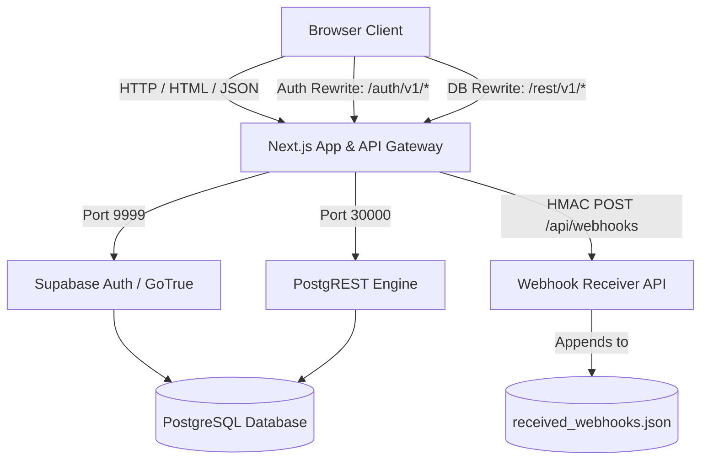

# Horizon: Candidate Pipeline & Recruiting Activity Tracker

[](https://nextjs.org/)
[](https://playwright.dev/)
[](https://supabase.com/)
[](https://tailwindcss.com/)
[](https://www.postgresql.org/)
[](https://opensource.org/licenses/MIT)

**Horizon** is a production-grade candidate pipeline tracking and hiring management platform. Built as a comprehensive QA engineering portfolio project, it showcases robust end-to-end testing practices, rigorous role-based access controls (RBAC), and server-side activity audit trail systems.

---

## 📸 Screenshots

| Dashboard Analytics | Candidate Directory | Candidate Detail & Pipeline |
| :---: | :---: | :---: |
|  |  |  |

---

## 🚀 Key Features

*   **Interactive Hiring Pipeline**: Seamless stage transition buttons (`Applied` ➔ `Screening` ➔ `Interview` ➔ `Offer` ➔ `Hired` / `Rejected`).
*   **Role-Based Access Control (RBAC)**: Secure access levels for Administrators, Recruiters, and Guest Viewers.
*   **Immutable Activity Audit Trail**: Auto-computes changed-field logs (from/to diffs) on candidate record mutations.
*   **HMAC-Signed Interview Webhooks**: Server-side webhook dispatch on status changes to `Interview` with cryptographically verified HMAC-SHA256 headers.
*   **Full Testing Suite**: 30+ E2E browser tests and specialized API validation scripts written with Playwright.
*   **Search & Filter**: Debounced live search with pipeline status filtering.
*   **Public Application Portal**: Candidates can self-apply through a public form without authentication.

---

## 🏗️ System Architecture

Horizon relies on a unified Docker Compose architecture proxying authentication and database requests to keep the browser environment CORS-free:



*   **Origin Unification Proxy**: The Next.js server acts as an API gateway rewriting client requests. `/auth/v1/*` routes to `gotrue:9999`, and `/rest/v1/*` routes to `postgrest:3000`, securing internal service details from external exposure.
*   **Security Validation Design**: Authentication JWTs are verified client-side for routing redirects, while PostgreSQL Row-Level Security (RLS) and cryptographic validations secure mutations at the database level.

---

## 🔑 Demo Sandbox Access

Horizon is pre-seeded with three access levels (Password: **`password123`**):

| User Email | Role | UI View Access | Actions Permitted |
| :--- | :---: | :--- | :--- |
| `admin@recruiting.local` | **Admin** | Dashboard, Candidate List, Profile Detail | Full CRUD permissions (can delete candidates, reset sandbox). |
| `recruiter@recruiting.local` | **Recruiter** | Dashboard, Candidate List, Profile Detail | Partial CRUD permissions (can create & edit candidates, cannot delete). |
| `viewer@recruiting.local` | **Viewer** | Dashboard, Candidate List, Profile Detail | Read-only permissions (can search, filter, and review details). |

---

## 🛠️ Local Installation & Development

### Prerequisites

*   Docker & Docker Compose installed.
*   Node.js (v18+) installed for running local tests.

### Deployment Steps

1.  Clone the repository and enter the directory:
    ```bash
    git clone https://github.com/YOUR_USERNAME/horizon-recruiting-platform.git
    cd horizon-recruiting-platform
    ```
2.  Deploy the local containerized stack:
    ```bash
    docker-compose up --build
    ```
3.  Access the platform in your browser: [http://localhost:3000](http://localhost:3000)

### Resetting the Sandbox
The database is initialized automatically with test seeds. During testing or manual walkthroughs, you can reset the sandbox database at any time by clicking the **"(Dev Only) Reset Database"** button on the Login page or by sending an empty `POST` request to:
```bash
curl -X POST http://localhost:3000/api/test/reset
```

---

## 🧪 Testing Suite & QA Verification

The repository includes a comprehensive testing infrastructure with **30+ test cases** designed to enforce stability across UI and API layers.

### Running Tests
```bash
# Install local dependencies & Playwright browsers
npm install
npx playwright install chromium

# Run all tests headlessly
npm run test

# Open Playwright UI mode for interactive inspection
npx playwright test --ui
```

### Test Coverage Matrix

| Test File | Category | Tests | Coverage |
| :--- | :--- | :---: | :--- |
| `tests/api.spec.ts` | API Protection & Validation | 12 | Auth 401, RBAC 403, input validation 400, HMAC webhook 401, CRUD lifecycle, public apply API |
| `tests/auth.spec.ts` | Role-Based Authentication | 3 | Unauthenticated redirects, Admin login/logout, Viewer read-only access |
| `tests/apply.spec.ts` | Candidate Self-Application | 1 | Full public apply → Admin review → detail verification flow |
| `tests/candidates.spec.ts` | Candidate Management CRUD | 2 | Create/edit/audit trail validation, Admin delete with confirmation modal |
| `tests/dashboard.spec.ts` | Dashboard Analytics | 4 | Pipeline statistics accuracy, recent activity, role-based dashboard views |
| `tests/search-filter.spec.ts` | Search & Filter | 6 | Name/email search, status filter, empty states, filter reset |
| `tests/pipeline.spec.ts` | Pipeline Stage Transitions | 4 | Stepper clicks, rejection flow, Viewer disabled buttons, inline dropdown |
| `tests/validation.spec.ts` | Form Validation | 7 | Apply form, add modal, edit form validation errors, cancel behavior |

### Detailed Test Case IDs

<details>
<summary>Click to expand full test case listing</summary>

#### API Endpoint Protection (`tests/api.spec.ts`)
| ID | Description |
| :--- | :--- |
| TC-AUTH-API-01 | Unauthenticated API queries return `401 Unauthorized` |
| TC-AUTH-API-02 | Recruiter attempting record deletion returns `403 Forbidden` |
| TC-AUTH-API-03 | Viewer attempting record creation returns `403 Forbidden` |
| TC-CAND-API-01 | Missing name or invalid email on candidate creation returns `400` |
| TC-CAND-API-02 | Authenticated user retrieves candidate list successfully |
| TC-CAND-API-03 | Recruiter creates candidate via API successfully |
| TC-CAND-API-04 | Empty name on candidate update returns `400` |
| TC-PIPE-API-01 | Invalid pipeline status enum value returns `400` |
| TC-WEB-API-01 | Webhooks without valid HMAC signature return `401` |
| TC-APPLY-API-01 | Public apply with missing name returns `400` |
| TC-APPLY-API-02 | Public apply with invalid email returns `400` |
| TC-APPLY-API-03 | Valid public application returns `201` |

#### UI Automation (`tests/auth.spec.ts`, `tests/apply.spec.ts`, `tests/candidates.spec.ts`)
| ID | Description |
| :--- | :--- |
| TC-AUTH-01 | Unauthenticated users redirected to login page |
| TC-AUTH-02 | Admin login, navigation verification, and logout |
| TC-AUTH-03 | Viewer read-only access limits verified |
| TC-APPLY-01 | Full candidate self-application → admin review flow |
| TC-CAND-01 | Create, edit, audit trail, and deletion limit validation |
| TC-CAND-02 | Admin deletes candidate with custom confirmation modal |

#### Dashboard, Search, Pipeline, Validation
| ID | Description |
| :--- | :--- |
| TC-DASH-01 | Dashboard displays accurate pipeline statistics for all seeded candidates |
| TC-DASH-02 | Recent candidate activity entries visible |
| TC-DASH-03 | Viewer sees dashboard in read-only context |
| TC-DASH-04 | Recruiter sees dashboard with management context |
| TC-SEARCH-01 | Search filters candidates by name |
| TC-SEARCH-02 | Search filters candidates by email |
| TC-SEARCH-03 | Empty search shows "no candidates match" state |
| TC-FILTER-01 | Status filter shows only matching candidates |
| TC-FILTER-02 | Rejected status filter works correctly |
| TC-FILTER-03 | Clearing filter restores all candidates |
| TC-PIPE-01 | Recruiter advances candidate via pipeline stepper |
| TC-PIPE-02 | Admin transitions candidate to Rejected status |
| TC-PIPE-03 | Viewer pipeline stage buttons are disabled |
| TC-PIPE-04 | Inline status dropdown updates candidate status |
| TC-VAL-01 | Apply form rejects submission without name |
| TC-VAL-02 | Apply form rejects invalid email |
| TC-VAL-03 | Add candidate modal rejects empty name |
| TC-VAL-04 | Add candidate modal rejects invalid email |
| TC-VAL-05 | Edit form rejects empty name |
| TC-VAL-06 | Edit form rejects invalid email |
| TC-VAL-07 | Cancel edit mode restores original data |

</details>

---

## 📋 QA Documentation

The `qa-docs/` directory contains a full set of QA engineering artifacts:

| Document | Description |
| :--- | :--- |
| [test_cases.md](qa-docs/test_cases.md) | Comprehensive test case specifications with preconditions and expected results |
| [regression_checklist.md](qa-docs/regression_checklist.md) | Pre-release regression checklist for all critical user flows |
| [bug_report_template.md](qa-docs/bug_report_template.md) | Standardized bug report template with severity classification |
| [production_verification_checklist.md](qa-docs/production_verification_checklist.md) | Production deployment verification steps |
| [risk_analysis_template.md](qa-docs/risk_analysis_template.md) | Risk analysis framework for feature releases |
| [pull_request_template.md](qa-docs/pull_request_template.md) | PR review template with QA sign-off checklist |

---

## 📁 Project Structure

```
├── src/
│   ├── app/
│   │   ├── api/                  # API routes (candidates, apply, webhooks, auth)
│   │   ├── apply/                # Public candidate application page
│   │   ├── candidates/           # Candidate list & detail pages
│   │   ├── dashboard/            # Analytics dashboard
│   │   └── page.tsx              # Login page
│   ├── components/               # Shared UI components (Navigation)
│   ├── lib/                      # Utilities (Supabase client, auth helpers, constants)
│   └── middleware.ts             # Route protection middleware
├── tests/                        # Playwright E2E test suite (8 spec files)
├── qa-docs/                      # QA engineering documentation
├── supabase/                     # Database migrations & seed data
├── docker-compose.yml            # Full-stack container orchestration
└── playwright.config.ts          # Test runner configuration
```

---

## 📄 License

Distributed under the MIT License. See `LICENSE` for details.
